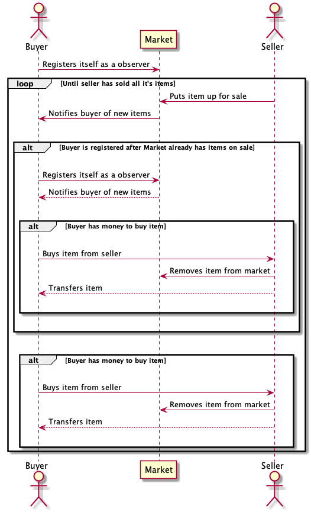
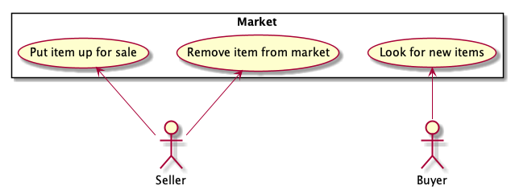
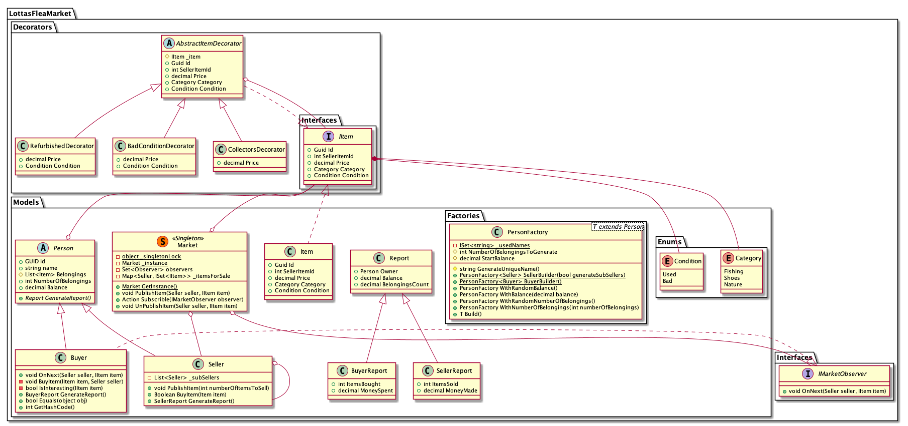

# Lottas Flea Market

## Process
We started the second week because of two main reasons; we both had two other exams the 12.11 out of 
which one also was an project exam, and one of us got sick and hospitalized for a few days during the first week.

When we got started we began discussing features and solutions that would match the requirements. Then we
started creating some UML diagrams, continuing we started implementing everything in code.

Since we have both have most experience with Java we have had a lot of issues and annoyances where we
expected C# to work more like Java. As a result of that we have found a lot of things in C# that we like;
namely properties, and a lot of things we did not like.
Because this we had to change our class diagram during the development process, and we got to have multiple
good discussions about different design patterns. We also had to refactor the code a few times because we
felt that we should split functionality into more classes in response to the single responsibility principle in GRASP. 

We spent most of the time pair programming in that sens that one was writing code, whilst the other one was
looking ahead in addition to reviewing each line, and keeping track if we are following the class diagram we made.
For a project this small that mostly focuses on the quality of the code rather than the features and amount,
we feel that pair programming was beneficiary for the result and our learning.

## UML

### Sequence Diagram

The sequence diagram describes the flow of interactions between the different participants.
The Buyer might start by registering itself as an observer with the market so that whenever a seller puts
an item up for sale the market will notify the buyer of the new item so it can act upon it.
However if a buyer registers itself with the market after there is already items on sale, the market will immediately 
notify the buyer with all existing items, so it can act upon it. 
When the buyer is notified of items it will determine if it has enough money to buy the item.
If the buyer want to buy an item it will contact the seller which in turn will remove the item from the market.

### Use Case Diagram

The use case diagram describes two actors; a seller and a buyer both of which has their own use cases.
The application Market describes 3 different use cases; Putting an item up for sale and remove item 
from market which is used by the Seller, and Looking for new items which is used by the Buyer.

### Class Diagram

The class diagram showcases all classes, interfaces and enums, and in which namespace every class is in the application.
Is also shows the connection between the different elements, including inheritance, aggregation and composition.

## Design patterns

This application is obviously fairly simple and could have been made smaller and simpler, however to showcase 
our knowledge when it comes to design patterns by using it where applicable.
The design patterns we have implemented is *Decorator Pattern*, *Singleton Pattern*, *Composite Pattern*,
*Factory Pattern*, and *Facade Pattern*.

### Decorator Pattern
We utilize the decorator pattern when adding different states to an item.
To achieve this we have an interface that defines properties that should be on an item, then that interface is implemented
directly both on the undecorated item and on an abstract decorator class.
The abstract decorator class has default implementation for all properties in the interface, and it has an instance of 
the interface in which it proxies all the properties to.
Then we can in the extension of the abstract decorator class override the properties we want to change the value of.

Doing this we can add different states of the properties we already have by just adding a new decorator and wrapping
an item in it.  

### Singleton Pattern
The market is like a bus, responsible for relaying information to the buyers, so each seller don't have to have
a reference to each buyer. And not to have to pass the instance of the market to every seller and every buyer 
we decided to utilize the singleton pattern. This makes sure that there is only one instance of the market at any point
and that every seller and buyer has access to the market.

### Composite Pattern
The composite pattern was not super applicable in this application however it made som sense that one seller could
have other sellers, so whenever the root seller is asked to sell some items it can instruct it's sub sellers to do so
as well. This allows us to not have to interface with every seller in the simulation, and instead interface with only
a few or even just one and have all children do the same action. 

### Factory Pattern
We are using the Factory pattern to construct the buyer and seller, both of which is an extension of the person class.
This helps us having a more self explanatory and uniform instantiation experience no matter the configuration.

This also ensures some level of single responsibility in that the factory is the one that creates everything
regarding the person and it's belongings.

### Facade Pattern
Facade pattern is a pattern mostly used for hiding complexity in a library, framework, or an old codebase.
So we feel that it isn't super applicable here as well, however we figured that an simulation class could 
be applicable here. Then we get one simple interface for configuring options when starting an simulation.

## GRASP
When it comes to GRASP we have not had a lot of conversations about it beforehand, however when looking at
the solution we feel that we have gotten a lot of things right. This might be because of our use of design
patterns, and it seem that GRASP come for free when following the different patterns.
GRASP feels mostly like common sense, in that code that follows the GRASP guidelines is easy to read and
make sense of, and vise-versa; that meaningful and easy to read code often follows most GRASP guidelines.

##Unit Testing
We have covered much of the application with unit tests. We tried to make unit test as we wrote the methods and
application logic. This vas valuable as we implemented thread locks and other complex logic. E.g. no items
were allowed to be sold twice. To make sure that our logic worked we have a check that make sure that
all items owned by all buyers is distinct and that number of items simlulation started 
is equal to number simulation ends with.
Other unit test checks if no buyers has negative balanance after the simluatin, no persons has the same name,
that a buyer can't buy if item price is higher than belance etc. 
We wanted to make unit tests that did check what to exam described the application to fulfill.

 
